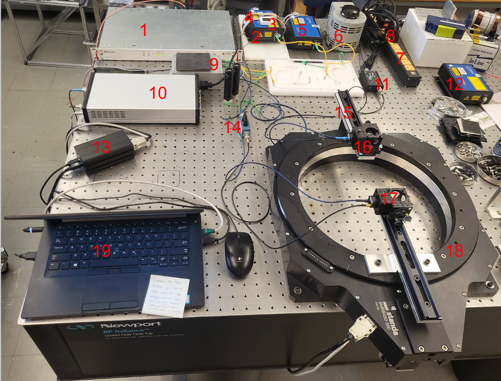

# Toptica Terascan 1550

**CAUTION\! ONLY CONNECT AND DISCONNECT THE PHOTOMIXERS ELECTRICALLY WHEN BOTH OF THE LASERS ARE TURNED ON.** 

General Rule: Don’t mess with a setting you do not understand or without a reason to modify it. Unless the setting is specifically mentioned in this document, you should not need to change it\! Many parts of this setup are very sensitive, and you don’t want to fry anything\!

Below: labeled diagram of the setup 

1. DLC Smart  
2. Laser \#1  
3. Thermometer  
4. Heat strap  
5. Laser \#2  
6. Transformer  
7. Power strip  
8. PDA-S power supply switch  
9. Fiber Stretcher  
10. High-Voltage Amplifier  
11. PDA-S power supply  
12. Laser \#3 (not currently in use)  
13. Rotational stage manual control  
14. BNC breakout box with link inserted  
15. Rulers (photomixer housings can be slid to adjust distances)  
16. Rx Photomixer housing (mirror \+ photomixer)  
17. Tx photomixer housing (mirror \+ photomixer)  
18. Rotational stage  
19. Laptop with Toptica 

# Toptica

## Power-Up

Modified from section 9.2.2 of the Terascan 1550, Terabeam 1550 manual

1. Make sure that the bias voltage line to the transmitter (Tx) photomixer (17)  is interrupted by removing the U-shaped link of the BNC breakout box (14).

2. Switch the DLC smart (1) on with the switch on the back. The booting procedure will take about 45 seconds. If the fan on the left side of the DLC smart turns on, the booting procedure is running. As soon as the system is ready, the system beeps and the System Ready light on the front panel should flash green.  
   1. There should be a key in the front panel of the DLC smart. Ensure it is turned to “unlocked”.

3. Start the computer (19) and launch the TOPAS TeraScan Control Software.  
   1. On the top left of the screen, select DLC Smart \-\> Connect  
   2. On the top left of the screen, select Settings \-\> SuperUser Mode. Enter the password “Toptica”. This will give you access to all settings and data collection.

4. Turn on both lasers using either the Laser Emission On/Off button in the top center of control software (19), or the ON button on the front panel of the DLC smart (1). The white emission lights should turn on for both lasers (2, 5\).

5. Turn on the PDA-S power supply by flipping the red switch (8) plugged into the power strip (7).

6. Close the bias voltage line to the transmitter (Tx) photomixer (17) by inserting the U-shaped link of the BNC breakout box (14).

7. Switch the high-voltage amplifier on using the red switch on the front panel of the high-voltage amplifier (10).

8. In the center of the control system (19) screen under “Frequency scan”, make sure the “precise” option is chosen. Then, scroll to the last folder, “Fiber Stretcher,” on the right-hand side of the control software, and ensure the “Fast phase modulation via fiber stretcher” checkbox is checked.

9. On the right-hand side of the control software, under the “Lock-in” folder, click “Set Bias to Default”.

## Aligning the photomixers

Before you take any measurements, it is good practice to align the photomixers optically. This allows for the best signal-to-noise ratio. This section assumes the Power-up procedure has been properly followed.

1. Rotate the rotational stage (18) so that the two photomixers (16, 17\) are at a 180-degree angle by eye. You can use your hands to rotate the stage. Try to get as close as possible to 180 degrees (but don’t toil over getting it exactly perfect).

2. In the center of the control system (19) screen under “Fixed Frequency”, type in a set frequency value. A good value is 100 GHz because this frequency has a very high amplitude, so any adjustments you make will be more noticeable.

3. On the right-hand side of the control software, under the “Lock-in” folder, enter a smaller integration time in milliseconds in “Int. Time (ms)”  to get faster data updates.   
   1. A good value for this is 30 ms.

4. Click the “Sampling” button. All of the graphs should start updating with live data. 

5. On the back of the Tx photomixer housing (17), there are two key knobs. These adjust the mirror that collimates the light from the photomixer.  
   1. Slowly turn one of the knobs. Notice how the amplitude on the bottom graph of the control system either increases or decreases depending on which way you turn. Using this graph to help you, find where the amplitude is maximized by just adjusting this knob.  
   2. Now do the same for the second knob.   
   3. You’ll notice there are only 2 knobs, but 3 places to put them. Slide out one of the knobs and repeat with the third slot.   
   4. Continue adjusting all these knobs little by little until you find the maximum amplitude you can achieve.

6. On the back of the Rx photomixer housing (16), you will find the same setup as the Tx photomixer housing with 2 knobs and 3 slots. Adjust this mirror in the same manner as step 4\!

7. Continue finely adjusting all 6 knobs (16, 17\) until you have reached the maximum amplitude (19). You can also finely adjust the rotational stage (18).

8. Turn off sampling by clicking the “Sampling” button in the control software (19). At the bottom center of the screen, click the “Clear Data” button.

## Taking a Measurement

This section assumes the Power-up procedure has been properly followed, and ideally, the Alignment procedure.

### Frequency Range Scan

This is likely the most common type of scan you will take.

In the control software (19):

1. Under “Fixed Frequency” in the center of the screen, enter the minimum value of the frequency range you wish to scan over. The system will stabilize at this value. 

2. Under “Frequency Scan” in the center of the screen:  
   1. Enter the minimum and maximum values of the frequency range you wish to scan over.   
   2. Enter the frequency step (how much the system should increase the frequency by each time it takes a measurement).  
      1. A good value for this is 0.1 GHz, but your needs may vary. Larger step size results in a quicker scan but less precision.

3. On the right-hand side of the control software, under the “Lock-in” folder, enter the integration time in milliseconds in “Int. Time (ms)” (the amount of time to be spent stabilizing before taking a measurement at each frequency step).   
   1. A good value for this is 30 ms, but your needs may vary. Smaller integration time results in a quicker scan but less precision.

4. Ensure the frequency is relatively stabilized by looking at the actual frequency value under “Fixed Frequency”.  
     
5. On the right-hand side of the control software, under the “General” folder:  
   1. Click the “Beep when finished” check box.   
   2. Deselect the “Use Default” check box and select the data columns you wish to save.

6. Under “Frequency Scan”, click “Scan Up”. All of the graphs should start updating with live data. 

7. When the scan is complete, the DLC Smart (1) will beep, the graph will stop updating with data, and the frequency will stabilize at the maximum frequency you entered. Under the “General” folder, click the “Save Data” button.   
   1. Note: Do not use the “Save Analyzed Spectrum” button. That saves a blank text file.

8. Save the file in a sensible location, and give it a sensible title. Also, double-check that the file was saved properly by opening it and making sure the expected data is inside. (Every once in a while, the software will save a blank file. If this happens, try saving the data again- it should work).

9. The Toptica does not have a good logging system, so it is good practice to take notes about the specifics of the setup, the room, etc.. You can save a text file in the same location as the data you saved. Things you should record (but not limited to):  
   1. Date  
   2. Angle of photomixers  
   3. Description of the samples you’re testing (if any)  
   4. How the samples were mounted  
   5. Were the lights on/off in the room during measurement  
   6. Frequency range  
   7. Step size  
   8. Integration time  
   9. How long was the Toptica on before taking data  
   10. What each of the datasets you take is  
   11. Reason for doing this experiment  
   12. Anything at all different/unique/etc. about this experiment

10. Click “Clear Data” at the bottom of the screen to prepare for another scan.

### Fixed Frequency Scan

This type of scan is typically used for stability measurements.

In the control software (19):

1. Under “Fixed Frequency” in the center of the screen, enter the fixed frequency value you wish to scan at. The system will stabilize at this value. 

2. On the right-hand side of the control software, under the “Lock-in” folder, enter the integration time in milliseconds in “Int. Time (ms)” (the amount of time between each measurement is taken).   
   1. A good value for this is 30 ms, but your needs may vary.

3. Ensure the frequency is relatively stabilized by looking at the actual frequency value under “Fixed Frequency”.  
     
4. On the right-hand side of the control software, under the “General” folder, deselect the “Use Default” check box and select the data columns you wish to save.

5. Under “Fixed Frequency”, click “Sampling”. All of the graphs should start updating with live data. 

6. When you are done collecting data, click “Sampling” to stop data collection.

7. Under the “General” folder, click the “Save Data” button. 

8. Save the file in a sensible location, and give it a sensible title. Also, double-check that the file was saved properly by opening it and making sure the expected data is inside. (Every once in a while, the software will save a blank file, if this happens, try saving the data again- it should work).  
     
9. The Toptica does not have a good logging system, so it is good practice to take notes about the specifics of the setup, the room, etc.. You can save a text file in the same location as the data you saved. Things you should record (but not limited to):  
   1. Date  
   2. Angle of photomixers  
   3. Description of the samples you’re testing (if any)  
   4. How the samples were mounted  
   5. Were the lights on/off in the room during measurement  
   6. Set frequency  
   7. Step size  
   8. Integration time  
   9. How long was the Toptica on before taking data  
   10. What each of the datasets you take is  
   11. Reason for doing this experiment  
   12. Anything at all different/unique/etc. about this experiment

10. Click “Clear Data” at the bottom of the screen to prepare for another scan.

## Power-Down

Modified from section 9.2.2 of the Terascan 1550, Terabeam 1550 manual. This section assumes the Power-up procedure has been properly followed.

1. Set the Tx Bias Offset and Tx Bias Amplitude to zero by clicking the “Set Bias to Zero” in the “Lock-in” folder on the right side of the control software (19).

2. Switch the high-voltage amplifier off using the red switch on the front panel of the high-voltage amplifier (10).

3. Turn off the PDA-S power supply by flipping the red switch (8) plugged into the power strip (7).

4. Interrupt the bias voltage line to the transmitter (Tx) photomixer by inserting the U-shaped link of the BNC breakout box (14).

5. Turn off both lasers using either the Laser Emission On/Off button in the top center of control software (19), or the OFF button on the front panel of the DLC smart (1). The white emission lights should turn off for both lasers (2, 5\).  
     
6. On the top left of the control software (19), select DLC Smart \-\> Disconnect.

7. Switch the DLC smart (1) off with the switch on the back. The lights on the DLC Smart should turn off.

# Standa Rotational Stage

## Power-Up

1. Plug the Standa Controller (13) into the power strip (7).

2. On the computer (19), launch XILab. Select the Serial 35119 option, and click “Open selected”. 

3. **CAUTION\! DON’T SLAM THE PHOTOMIXERS INTO EACH OTHER.** Before controlling the rotational stage (18), set up proper borders with the Default settings below.

## Software Control 

### Applying Necessary Default Settings

Before using these settings, please ensure the Toptica is optically aligned at 180 degrees (see the “Aligning the photomixers” section). 

1. In the control software (19), click “Zero” on the right side of the screen.

2. Click “Settings…” on the top right of the screen. 

3. In the new window, click “Load settings from file…”. Locate the file: “default-5-29-25.cfg” in C:\\Users\\Public\\Standa Settings. 

4. Click “Apply” at the bottom right. The file name should light up above the “Load settings from file…” button. Click “OK”.   
   1. Proper borders and rotation speed are now in place; you can control the rotational stage (18) safely with either the manual control (13) or software control (19). The rotational stage will not rotate beyond the labeled s

Note: You can also customize your own settings/play around with things like the speed of the rotational stage and save them to your own file for later use. If you do this, **REMOVE THE TX PHOTOMIXER**. The rotational stage settings are not always intuitive, so make sure you’re not risking damage to the photomixers by playing around with the rotational stage settings.

### General No-No’s

This section assumes the default settings are in place as described in “Software Control: Applying Necessary Default Settings”.

Some of the buttons in the control software are very tempting, but don’t do what you think they might do.  
 

* **DON’T CLICK THE “ZERO” BUTTON.** But if you do, it’s okay. **JUST DON’T SEND ANY FURTHER COMMANDS UNTIL YOU’VE DONE THE FOLLOWING.**  
  1. The borders of the rotational stage are defined by position (we don’t have limit switches installed). So, if you re-zero the rotational stage, the borders will redefine to the new zero, meaning the photomixers can now potentially crash into each other.  
  2. With your hands, move the rotational stage back to 180 degrees. See “Aligning the photomixers” for precision.  
  3. Click the “Zero” button again. You’re back in business.

* The “Go home” button and settings are not intuitive. Use “Move to” to move back to 180 degrees, described in the “Useful Capabilities” section

### Useful Capabilities

This section assumes the default settings are in place as described in “Software Control: Applying Necessary Default Settings”.

Note: After manually controlling the system, the rotational stage (18) will temporarily lock in place. After \~1 minute, you should be able to move the rotational stage with your hands again. If you are impatient, you can unplug the Standa Controller (13) from the power strip (7). 

In the control system (19):

* To move the rotational stage back to 180 degrees, use the “Move to” button in the bottom center of the screen, and enter “0 counts”.   
  1. You can also use the “Move to” button to move to any specific position- just enter the desired count number.  
       
* To move the rotational stage left and right and stop its movement, use the buttons in the center of the screen or the green buttons on the manual controller (13).  
    
* The “Cyclic” button on the right side of the screen will automatically rotate from border to border until you click “Stop”.  
    
* To collect data from the Standa, click “Charts” on the top right.   
  1. In the new window, select the data you wish to see updated live.   
  2. To save the data, click “Export to CSV”. This will save all of the data columns, not just the ones you selected to visualize.  
  3. Click “Clear” to prepare for another set of data.

## Power-Down

1. On the computer (19), close XILab. 

2. Unplug the Standa Controller (13) from the power strip (7). **CAUTION\! MAKE SURE YOU UNPLUG THE CORRECT CORD.**  
   1. Unplugging the wrong cord could potentially be very dangerous to the Toptica equipment and you if the Toptica is still on.

# Temperature Readout

# References

## Physical Manuals

These should be in the lab.

* Toptica Manual (red binding)  
* High Voltage Amplifier (has a picture of it on the front)

## Online Manuals/Resources

More manuals for the Standa and Toptica in Google folder  
Veronica URS poster  
[https://toptica.github.io/python-lasersdk/index.html](https://toptica.github.io/python-lasersdk/index.html)  
[https://www.toptica.com/products/terahertz-systems/frequency-domain/terascan](https://www.toptica.com/products/terahertz-systems/frequency-domain/terascan)

## Github